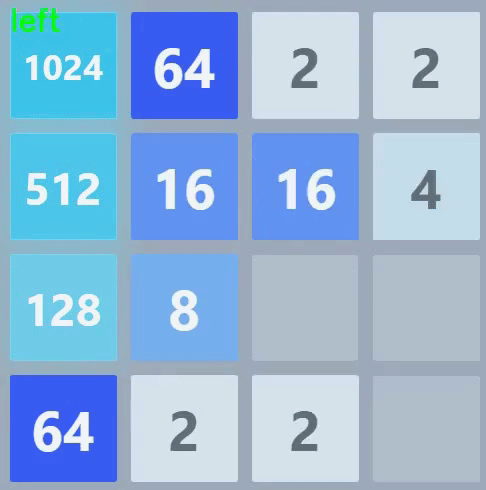

# 2048-CV-Bot

A Python-based bot that plays the 2048 game automatically using computer vision and smart decision-making. It watches the game on your screen, figures out the best moves and presses keys to play just like a human. The bot also records its gameplay as a video so you can see it in action.



## How it works?

### 1. Looking at the Game (Screen Capture)
The bot takes a screenshot of the 2048 grid using a tool called pyautogui. Think of it like the bot snapping a photo of your screen where the game is. It uses the coordinates from CONFIG section to know exactly where to look.

### 2. Understanding the Grid (Color Detection)
The bot looks at the colors in the screenshot to figure out which numbers are in each cell. For example, a light beige color might mean a "2" while orange means "16". It checks the average color of each square, then matches these colors to a list it knows, like COLOR_MAP in the code.

### 3. Thinking About Moves (Minimax Algorithm)
The bot decides the best move by pretending to play the game in its head several steps ahead.

**How?** <br>
1. Try Every Move - it imagines sliding the tiles each way to see what happens.
2. Guess New Tiles - after each move, the game adds a 2 or 4 randomly. The bot guesses where these might go (90% chance of 2, 10% of 4).
3. Score the Outcome - it gives each possible future a "score" based on how good it looks.
4. Pick the Best - it chooses the move that leads to the highest score, even after the random tiles are added. This is like a chess player thinking, "If I move here, and they move there, what’s my best option?

This "thinking ahead" helps the bot avoid bad moves and aim for big tiles like 2048.

### 4. Scoring the Grid (Heuristic Evaluation)
The bot gives a number (score) to each possible grid to decide if it’s good or bad.
It looks at several things: <br>
- Empty Spaces - more empty cells = higher score (more room to move).
- Big Tiles - a higher max tile (like 16 vs 4) = better score.
- Corner Bonus - if the biggest tile is in the top-left corner, it gets extra points.
- Order - tiles in a neat row (like 16, 8, 4, 2) get a bonus because they’re easier to merge.
- Merges - two 4s are next to each other, it’s good, they can become an 8!
- Penalties - big tiles far from the corner or stuck between small tiles (like a 16 surrounded by 2s) lower the score.

This scoring helps the bot balance short-term wins (merging tiles) with long-term goals (building a 2048 tile).

### 5. Making the Move (Keyboard Input)
The bot presses a key to move the tiles. It uses the keyboard library to act like a human pressing keys.

## Usage
1. **Set Up Coordinates in ```CONFIG```** - 
tell the bot where the game grid is on your screen.
2. **Open 2048** - 
start the game in a browser. Don’t move the window once the bot starts!
3. **Run the Bot** -
```python bot2048.py```
4. **Press Q to Stop**
